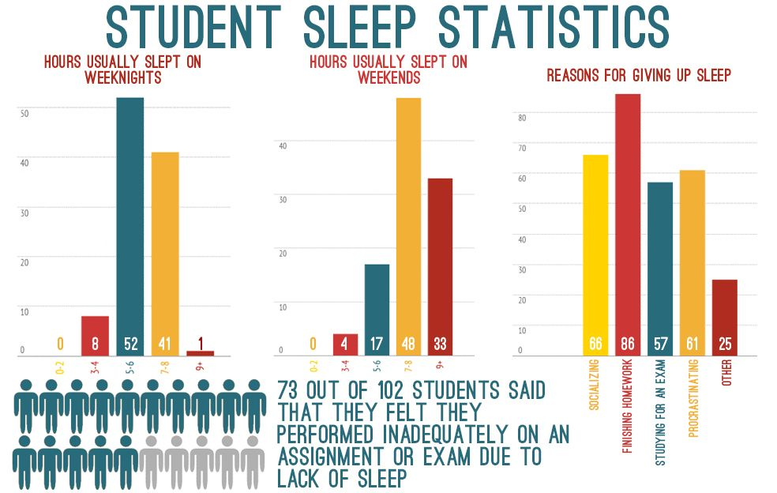
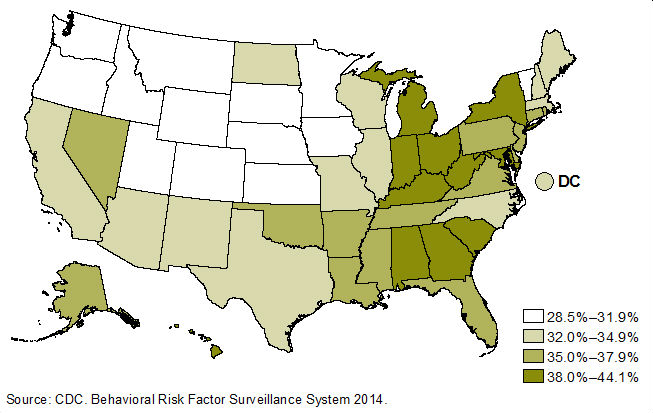

 # The Importance of Sleep
### Project:
Why sleep when there’s Netflix?

### Team: 
Emma Dickenson,  
Balqisa Omar Hassan,  
Jocelyn Borovich,  
Rae Ouyang

Info-201: 
Technical Foundations of Informatics  
The Information School   
University of Washington  
Autumn 2019

## Introduction

**Problem Situation:**

>Sleep is essential for human survival, success, and maintaining the balance for overall health yet so many still don’t view sleep as a basic human right. As a result, this study will look at the relationship between sleep and overall success. Sleep is a major part of health and wellbeing yet many policies surrounding poverty and workers rights don't take into account this value. This factor then raises questions on what we value and deem as important.

**What is the problem?** 

>Approximately one-third of the American population does not get enough sleep, yet a lack of sleep can have serious effects such as poor physical and mental health (Healthline 1). Oftentimes, people prioritize other responsibilities, such as work, school, exercise and socialization over sleep, but at a certain level of lack of sleep, performance in these tasks are diminished. This study will assess the tradeoff between getting enough sleep and accomplishing these other activities.  

**Why does it matter?**

>Sleep is essential to human life. Therefore, it should be prioritized to people so they can enjoy their lives at full potential. According to NHS, without the right amount of sleep people experience short term effects such as short tempers, lack of focus, and fatigue. They can also experience numerous long term effects including depression, anxiety, obesity, heart disease, and shortened life expectancy. When people suffer these consequences, it affects their daily life in many places such as relationships, work ethic, performance, and even overall self love and confidence. 

**How will it be addressed?**

>In the study, “success” will be broken down into different factors such as Health(life length), Happiness(life satisfaction), Confidence Level, Salary Level, Education Level, GPA, Extracurricular Activity, etc. Looking at how sleep affects these factors of “success” will allow us to address whether or not sleep affects performance levels in these areas. The study will gather data by using pre-existing datasets surrounding sleep.

## Research questions

1. How does the amount of sleep one gets correlate to their career pathway/education?

2. How does the amount of sleep one gets correlate to their overall health and self-love?

## Possible data sets
 
 ### American College Health Association - National College Health Assessment

**Description:**  
The ACHA-National College Health Assessment is a nationally recognized research survey that covers a wide range of health issues about college students. It has large enough polls and provides sufficient evidence for the correlation between college students’ academic performance and several factors. 

**Link:**   
https://www.acha.org/NCHA/ACHA-NCHA_Data/Publications_and_Reports/NCHA/Data/Reports_ACHA-NCHAIIc.aspx

**Observations:** 67972  
**Attributes:** 66

 
### 2008 Sleep, Performance and the Workplace

**Description:**   
A nationwide survey of Americans conducted by the National Sleep Foundation on how much sleep they get and how it effects their daily lives with tasks such as work, driving, sex life, and life at home. 

**Link:**  
https://www.sleepfoundation.org/professionals/sleep-america-polls/2008-sleep-performance-and-workplace

**Observations:** 1000  
**Number of Attributes:** 217

## Visualizations
 
   
This graphic shows statistics specific to students about their sleeping habits and why they have them. We plan to make a similar visualization representing sleep correlations with specific jobs, education, and salaries. In our project, we would like to implement something similar.

  
This graph shows the sleep deprivation statistic of each state in the U.S. In our project, we propose to create a similar information visualization and allow users to explore state-level details.

## Team Coordination 

**Weekly Meeting Time:** Thursday 3:30 - 5:30 P.M.  
**Source:** https://www.when2meet.com/?8325592-N2c2A

### Individual goals/roles: 
**Jocelyn:**  
- **Goals**:  
 Gather and analyze data on a topic of which the resulting analytics can benefit society and provide interesting results. Also, I’d like to produce the findings on Github in such a way that it may be displayed as a project on my resume or Linkedin profile. 
 
- **Roles**:  

**Rae**:   
- **Goals**:

- **Roles**:  

**Balqisa:**

- **Goals**: Produce good quality work and gain relevant data science skills. 

- **Roles**: 

**Emma**: 
- **Goals**: 

- **Roles**: 

### Weekly Communication Commitment: 
>At our group meeting every week, we decide who needs to do what tasks by a certain deadline. We then use a group chat to communicate whenever there are any questions or concerns along the way. 

### Commitment on feedback, teamwork, communication  and challenges: 
>

## References:  
- Marcin (2017, June 27). 10 Things That Happen to Your Body When You Lose Sleep. Healthline. Retrieved from https://www.healthline.com/health/healthy-sleep/what-happens-to-your-body-when-you-lose-sleep
- Author not listed (2018, May 30). Why lack of sleep is bad for your health. NHS. Retrieved from https://www.nhs.uk/live-well/sleep-and-tiredness/why-lack-of-sleep-is-bad-for-your-health/
- Author not Listed (2019). About ACHA-NCHA. ACHA-NCHA. Retrieved from
https://www.acha.org/NCHA/About_ACHA_NCHA/Overview/NCHA/About/About_NCHA.aspx?hkey=75eaa64f-e82c-4cfd-a19c-4e3f9bf126ee
- Author not Listed (2019, August 19). NCHA-II_SPRING_2019_US_REFERENCE_GROUP_DATA_REPORT. ACHA-NCHA. Retrieved from
https://www.acha.org/documents/ncha/NCHA-II_SPRING_2019_US_REFERENCE_GROUP_DATA_REPORT.pdf
- Author not Listed (2008). 2008 Sleep, Performance and the Workplace. National Sleep Foundation. Retrieved from https://www.sleepfoundation.org/professionals/sleep-america-polls/2008-sleep-performance-and-workplace
- Author not Listed (2017, May 2). Sleep and Sleep Disorders - Data & Statistics. CDC. Retrieved from
https://www.cdc.gov/sleep/data_statistics.html 
