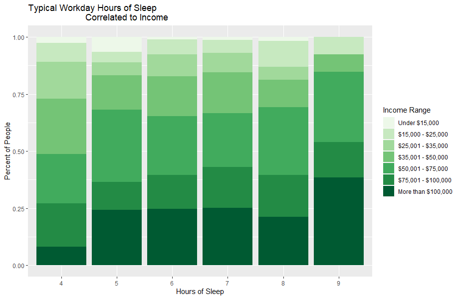
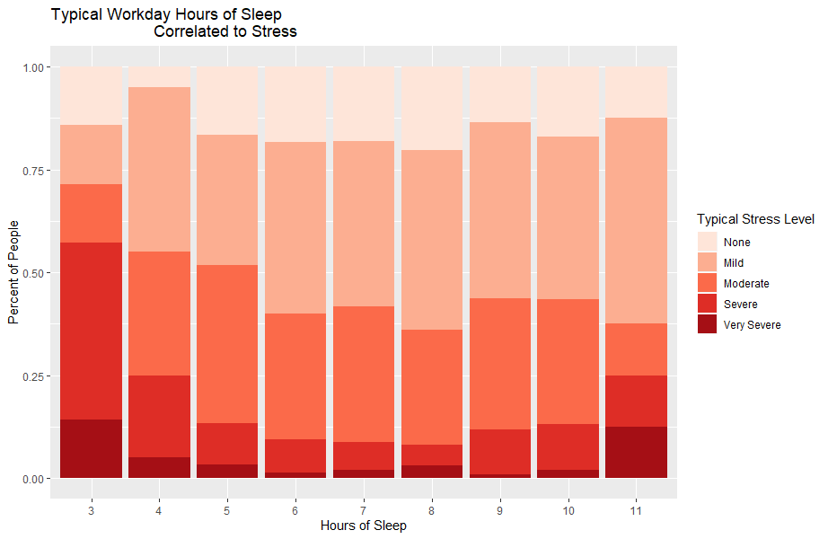

The technical report provides a complete description of the project.

### 1.0 Introduction

#### 1.1 Problem Situation
Sleep is essential for human survival, success, and maintaining the balance for overall health yet so many still don’t view sleep as a basic human right. As a result, this study will look at the relationship between sleep, overall success and health. Sleep is a major part of health and wellbeing yet many policies surrounding poverty and workers rights don't take into account this value. This factor then raises questions on what we value and deem as important.

#### 1.2 What is the problem?
Approximately one-third of the American population does not get enough sleep, yet a lack of sleep can have serious effects such as poor physical and mental health (Marcin 2017). Oftentimes, people prioritize other responsibilities, such as work, school, exercise and socialization over sleep, but at a certain level of lack of sleep, performance in these tasks are diminished. This study will assess the tradeoff between getting enough sleep and accomplishing these other activities.

#### 1.3 Why does it matter?
Sleep is essential to human life. Therefore, it should be prioritized to people so they can enjoy their lives at full potential. According to NHS, without the right amount of sleep people experience short term effects such as short tempers, lack of focus, and fatigue. They can also experience numerous long term effects including depression, anxiety, obesity, heart disease, and shortened life expectancy. When people suffer these consequences, it affects their daily life in many places such as relationships, work ethic, performance, and even overall self love and confidence.

#### 1.4 How will it be addressed?
Looking at how sleep affects factors of “success” will allow us to address whether or not sleep also affects performance levels in these areas. The study will gather data from American adults in the workforce by using pre-existing datasets surrounding sleep and will use data wrangling methods to optimize research goals. We will be cleaning and restructuring raw data in order to understand more about sleep. Furthermore, we will utilize the data and create information visualization that will represent and reflect our findings. 

### 2.0 Research Questions
The amount of sleep one gets correlate to their career pathway/education, overall health and the way they perceive themselves. We hope that further research in these areas will allow us to understand how important sleep is for every day functions and activities. We also hope to possibly address whether the amount of sleep one gets plays a significant factor in overall success.  The specific research question that we want to address are:

>**_How does the amount of sleep one gets correlate to their work performance and lifestyle?_**  
>**_How does the amount of sleep one gets correlate to their overall health and self-love, and happiness?_**

### 3.0 The Data Sets

#### 3.1 Data Sets
#### **_2015 Sleep and Pain_**
##### Description:
Sleep and Pain is also a Nationwide telephone interview conducted by the National Sleep Foundation to help encourage people to prioritize sleep for better health. This survey contains data on how much sleep Americans get along with the different levels of pain, fulfillment and happiness they feel on an average day.  Also accessed from the National Sleep Foundation Sleep in America Polls, this data set has a total of 1029 observations and 191 variables. Again,  each observation represents one person’s responses to each question in the survey, and each variable is the question itself or supplementing information about that question. As explained above, this survey included Americans 18+ whom work at least 30 hours a week. Because only 17% of people contacted completed the survey, many people were excluded from the data. Furthermore, some regions have a much higher response rate to the survey than others. For example, only 19% of the Northeast completed it while 36% of the south completed the survey. This causes an exclusion of lots of the Northeast compared to the South.  
[Link](https://www.sleepfoundation.org/professionals/sleep-america-polls/2015-sleep-and-pain)  

#### **_2008 Sleep, Performance and the Workplace_**
##### Description:
Sleep, Performance and the Workplace is a Nationwide telephone interview conducted by the National Sleep Foundation to help encourage people to prioritize sleep for better health. This survey found data on how much sleep respondents get and how it effects their daily lives with tasks such as work, driving, sex life, and life at home. Accessed from the National Sleep Foundation Sleep in America Polls, this data set has a total of 1000 observations and 217 variables. Each observation represents one person’s responses to each question in the survey, and each variable is the question itself or supplementing information about that question. This survey included Americans 18+ whom work at least 30 hours a week. Because only 17% of people contacted completed the survey, many people were excluded from the data. Furthermore, some regions have a much higher response rate to the survey than others. For example, only 19% of the Northeast completed it while 36% of the south completed the survey. This causes an exclusion of lots of the Northeast compared to the South.  
[Link](https://www.sleepfoundation.org/professionals/sleep-america-polls/2008-sleep-performance-and-workplace)

 

#### 3.2 Strength and Weakness
**Strength**:  
The size of both datasets. Both datasets included over 1000 observations. Although, even larger datasets could have made our analysis even more precise, 1000 observations is large enough to allow us to draw conclusions from the data. In addition, since both datasets had about 200 variables, we were able to answer our research questions in depth as we had lots of data to explore.  
**Weakness**:  
First, there is no continuous data in both datasets, so it is impossible to compare two variables graphically through scatterplots. For example, a scatter plot could have been used to compare income to number of hours of sleep per night; if instead of being recorded as a range, income was recorded by exact amount. In both datasets, all of the questions asked to the participants required categorical responses. Second, there exist bias in the method of data collection of both datasets. The data was collected through phone interviews. Certain groups of people may have been less willing to participate or be truthful than others, which may have skewed the data. 

#### 3.2.1. Strength and Weakness employing the Envisioning Cards
**Strengths** -- **Non-targeted Use**:  
We choose the Envisioning Card "Non-targeted Use" to clarify one big strength of our datasets: size. Even though this project focuses mainly on the relationship between sleep and work performance and overall health, as both of datasets possess big enough size, we can always dig deeper and research more problem about sleeping. What's more, people who get to know these datasets from our project could apply them to their own research or even just take a look and then receive some information about sleeping's role in one's life. In conclusion, because these datasets have great size, they can always be applied for unplanned or even better purposes in ways we do not intended, and affect people in ways we never realize.  
**Weakness** -- **Adaptation**:  
We choose the Envisioning Card "Adaptation" to clarify the weakness of our datasets. One big weakness of both datasets is the way they collecting data is biased. Therefore, even possessing big size, the situation these datasets revealed may still be baised and personal, and the result we could get from researching these data may be skewed and biased as well. Thus, people's adaptation of their lifestyles facilitated by our research may be led in unsuitable ways.

#### 3.3 Description of Data Wrangling
First looking at the raw data sets comes across as quite confusing and overwhelming. To make the data more readable and help find what we were looking for, we scrolled through the questionnaire provided taking notes of the specific questions that were of interest to analyze. Once all questions of interest where found, we read their corresponding responses from the raw data in R and analyzed different patterns and statistics. After selecting our columns of interest, we filtered out all the N/A values and trimmed the data to exclude extreme outliers such as 2 people saying they average 1 hour of sleep. In doing this we simply used a range of values as the filter. As shown in the data dictionary in the appendix, all N/A values are integers 95-99 and 00 and there is most definitely not more than 94 multiple choice options for any given question. For outliers we simply graphed the frequencies of the values and trimmed the data with ranges accordingly. Therefore, trimming out outliers and N/A values came quite simple.  
\*_Variable we filtered for the project - see Appendix 1_\*

### 4.0 Information Visualizations
#### Description:
The data visualized aims to create images that portray the effects of sleep on health as well as  performance in the workplace. The visual of stress vs sleep aims to answer questions about how sleep is correlated to health as the visual of income vs sleep aims to answer questions about how sleep is correlated with work performance. In visualizing the data sets we had to be aware that all of our data is categorical due to a multiple choice survey. We decided to use the stacked bar chart to portray comparisons between the two categorical variables. Furthermore, these charts use a percentage based frequency rather than count on the y-axis. This makes the visual more readable and accurate despite different amounts of people reporting various hours of sleep. The color scales use a fade from light to dark which helps portray the variables from least to greatest.

 

#### 4.1

 
This graphic shows a stacked bar chart of people’s typical hours of sleep correlated to their household income.  As shown, there is a steady increase in income per extra hour of sleep a person gets. It can be concluded that at 4 hours of sleep a night, 50% of people make over $50,000 a year, but at 9 hours of sleep, about 85% of people make over $50,000 a year. Therefore, with an extra 5 hrs of sleep a night, you have a 35% higher chance of making more than $50,000 a year. 

 

#### 4.2

 
This graphic shows a stacked bar chart of people’s typical hours of sleep correlated to their stress levels.  As shown in the chart, there is a trend of getting nearly 7 hours of sleep a night corresponding to much lower severe stress symptoms. As sleep time decreases and increases below 5 and above 10, severe stress levels rise. It can be concluded that with 4 hours of sleep a night, about 25% of people experience severe stress symptoms, but at 7/8 hours, only about 10% of people experience these symptoms. Therefore, adding 4/5 hours of sleep decreases chances of severe stress by 15%.

 

#### 4.3

 
This graphic displays a pie chart of the proportion of people that get various hours of sleep on workdays. From the chart it can be concluded that over 75% of people average less than 8 hours of sleep on work nights. 

### 5.0 Technical Description of Shiny Application
For the shiny application, our two datasets will be loaded as .csv files. For these data files, the major library used will be our separate data file. Our code will be organized with a section for loading files from their directories and then separate sections for the data analysis as well as another section for the ui of the shiny application. Through statistical analysis, the following question will be answered: “what is the correlation between sleep and other aspects of life?”. Using a drop down, users will be able to choose whether they want to see the correlation between the amount of sleep and education, amount of sleep and career path, amount of sleep and health, and amount of sleep and self-love. A pop-up window of statistical analysis of the corresponding category will appear. In addition, data visualizations that we create through analysis will be displayed. For example, a data visualization for our University of Washington data.

### 6.0 Conclusion
As our research surrounds sleep and success, we have been very fortunate to have the ability to use pre-existing data. Sleep is a topic that intrigues many researchers and as a result there is an abundance of sleep data that we are able to access for our project. Although there is this abundance, as students we struggled with gaining access to certain data sets that perhaps could have elevated our project. The time constraint of this project also hindered our ability to gather our own data set. In the future we hope to look at UW students and how sleep affects things such as GPA, happiness and perception. 

### Acknowledgements
We would like to express our gratitude to our teaching assistant, Benji Xie. Throughout the quarter, Benji has been at the forefront of our project, providing us both advice and guidance on the direction our research should go. 

### References
[1] Marcin (2017, June 27). 10 Things That Happen to Your Body When You Lose Sleep. Healthline. Retrieved from https://www.healthline.com/health/healthy-sleep/what-happens-to-your-body-when-you-lose-sleep  
[2] Author not listed (2018, May 30). Why lack of sleep is bad for your health. NHS. Retrieved from https://www.nhs.uk/live-well/sleep-and-tiredness/why-lack-of-sleep-is-bad-for-your-health/  
[3] Author not Listed (2019). About ACHA-NCHA. ACHA-NCHA. Retrieved from https://www.acha.org/NCHA/About_ACHA_NCHA/Overview/NCHA/About/About_NCHA.aspx?hkey=75eaa64f-e82c-4cfd-a19c-4e3f9bf126ee  
[4] Author not Listed (2019, August 19). NCHA-II_SPRING_2019_US_REFERENCE_GROUP_DATA_REPORT. ACHA-NCHA. Retrieved from https://www.acha.org/documents/ncha/NCHA-II_SPRING_2019_US_REFERENCE_GROUP_DATA_REPORT.pdf  
[5] Author not Listed (2008). 2008 Sleep, Performance and the Workplace. National Sleep Foundation. Retrieved from https://www.sleepfoundation.org/professionals/sleep-america-polls/2008-sleep-performance-and-workplace  
[6] Author not Listed (2017, May 2). Sleep and Sleep Disorders - Data & Statistics. CDC. Retrieved from https://www.cdc.gov/sleep/data_statistics.html  
[7] Axton-Schock. Effects of Sleep Deprivation on Health. Pinterest. Retrieved from https://www.pinterest.com/pin/550002173225650417/?lp=true 

## Appendix 1: Data Dictionary
Variable Name | Description | Data Type | Measurement Type
------------- | ----------- | --------- | ----------------
q7h | Free fill question:   **_“On workdays or weekdays, how many hours, not including naps, do you usually sleep during one night?”_** | Integer | Number of Hours
d8 | Multiple choice question:   **_“Please stop me when I read the category that includes your total annual household income.”_** | Integer | Numbers 1-7 representing increasing income ranges
Q6_HoursB | Free fill question:   **_“Considering that someone may or may not fall asleep as soon as they go to bed or may wake up during the night, about how much actual sleep would you estimate you typically get… On work nights or weeknights?”_** | Integer | Number of Hours
Q13_b | Multiple choice question:   **_"In the past 7 days, how would you rate … Your stress level on average?"_** | Integer | Numbers 1-5 representing increasing typical stress levels
00 | Participant does not fall into any of the response categories | Integer | Number representing "none"
95 | Participant does not fall into any of the response categories so they specified their own response | Integer | Number representing free fill “other” response
96 | Question does not apply to participant | Integer | Number representing N/A
97 | Participant has and exception to available responses | Integer | Number representing “other”
98 | Participant refused to respond to the question | Integer | Number representing “refusal”
99 | Participant does not know the answer to the question | Integer | Number representing “I don’t know” from participant

## Appendix 2: Reflections
Emma Dickenson:  
Through the first part of the project, I learned to get comfortable with shiny. Through my learning, I was able to develop important skills as a coder such as finding resources to help me complete tasks that I was not yet taught in class. Another skill that I learned was looking at other code, such as our class demos, to get a head start on my own code.
 

Balqisa Omar Hassan:  
This week I focused on developing and honing our research questions. It was very difficult to come up with potential questions that was relevant to the data sets we collected. Something that was satisfying was being able to meet with the group and make excellent progress on our project. While we are also confused and frustrated initially, we were able to produce work that we are proud of. As a thinker, this project really pushed me to be more open minded and accepting of change and the idea of potentially every detail and aspect not going as planned. 
 

Jocelyn Borovich:  
Throughout the beginning of this project, I definitely got much more comfortable working with different ways to visualize and read data with ggplot. During this process, I not only used the class textbook to learn more about the plots. I also developed skills in using the internet to combine different solutions together to form the final product that I wanted that goes beyond what is presented in class. I found creating the pie chart very frustrating as the data I was working with had to be arranged and changed in specific ways as well as needing different pieces of code from different places to satisfy a nice looking pie chart. 
 

Rae Ouyang:  
This project really teaches me what is teamwork and how great a thing could be achieved when several people get toghther and heading toward the same goal. By participating in this project, I have learnt a lot of things I don't think I can learn alone from lecture. For example, many detailing coding skill and the skill of dividing a big task into several small tasks (which would make completing the big task much more easier).

## Appendix 3: Use of Envisioning Cards
Based on our research question, we picked two envisioning cards: 1.Work of the Future, 2.Long-Term Health and Well-Being. Each envisioning card corresponds to each research question. When tried to make use of these cards, we viewed our project as a product that would be used by our customers. For example, people who browse our website due to curiosity or willing to learn more about sleeping. For “Work of the Future”, we consider our research project would help improve the way people work by disclosing to them how sleep functioning in their work performance. In today’s workforce, employees always willing to dedicate more time, even including their personal sleeping time to work. However, after viewing our project, employees would realize spending more time on work by no means better and more things would be done--without good and enough rest, they may just wasting their time. For “Long-Term Health and Well-Being”, we believe as we released how the amount of sleep get correlate to people’s overall health and self-love and happiness in our project, our “customers” would realize the importance of sleep to their long-term health and well-being and thus would pay more attention to having a good sleep habit and schedule.